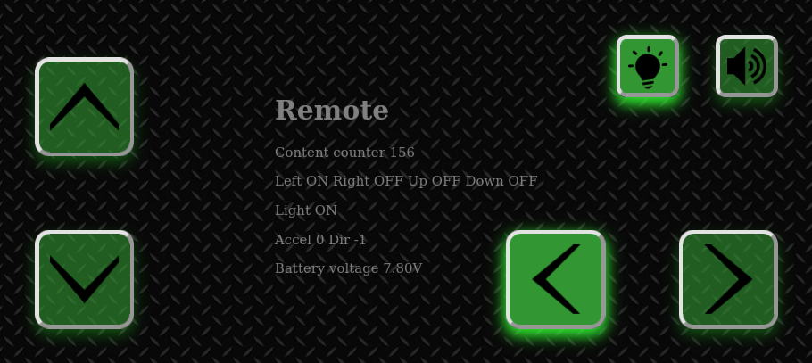
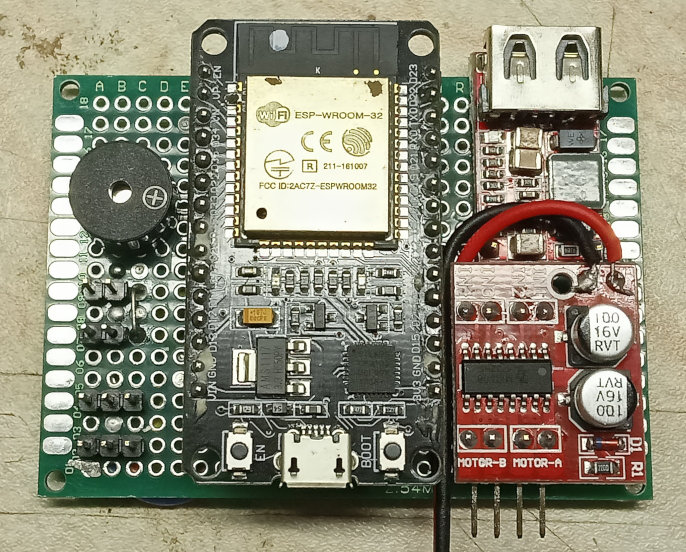
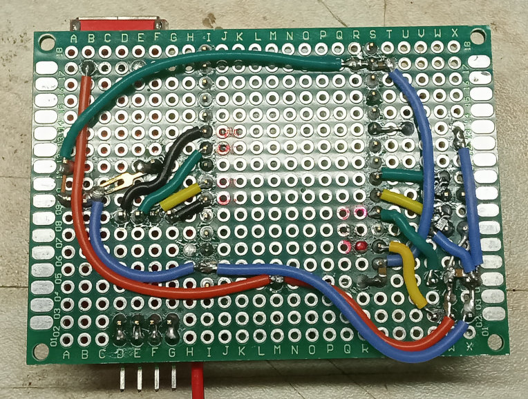
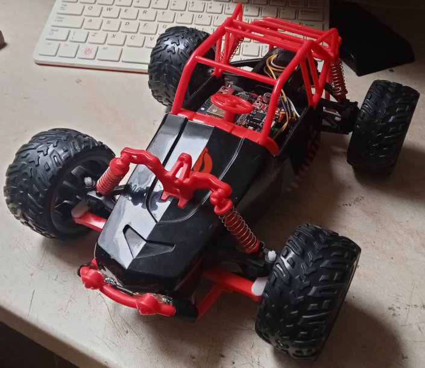
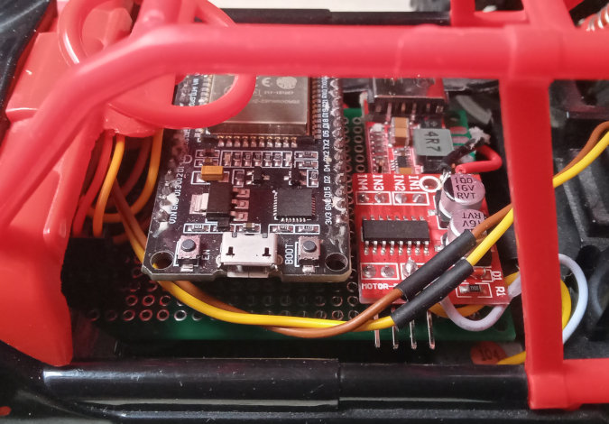

# Remote

Webi based remote controll (concept proof). ESP32 based AP hosts web interface, which acts as the remote controll for the toy car. You can connect to the AP and open the webi with the browser, for example on your mobile phone.

Actual webi contains 5 momentary buttons (dirrections and beeper) and one toggle button (lights). The graphical feedback shows if the button is active (pressed or toggled).

The device also measures the battery voltage which is displayed on the interface too.

## Hardware (prototype)

Prototype contains

- ESP32 dev board
- Battery voltage measurement (1k0, 4k7, 100n divider)
- 5V stepdown converter for servos and dev. board
- MX1508 motor driver (dual)
- 2 servo outputs
- 2 open collector NPN outputs (lights)
- beeper

### Front

### Back

## Test gear

The prototype has been tested on the cheap toy car which was rebuild to have a proportional stearing using 9g servo. Althrought the poportionality is not major in this project.

- servo stearing
- led lights
- acu replacement

### Detail

The driver was (luckily) placed the way the USB programming connector is accesible.

# Result (so far)

It works. It doesn't have the fastests response, so its not suitable for the fast moving toys or robots. But its easy to implement and it can be easily expanded with other endpoints or features.
